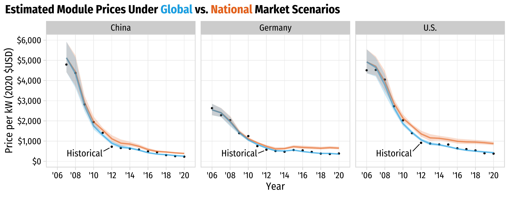

```{r setup, include=FALSE}
library(knitr)
library(fontawesome)
library(tidyverse)
library(metathis)
library(logitr)
library(cbcTools)

options(
    htmltools.dir.version = FALSE,
    knitr.table.format = "html",
    knitr.kable.NA = '',
    dplyr.width = Inf,
    width = 250
)
knitr::opts_chunk$set(
    warning = FALSE,
    message = FALSE,
    fig.path = "figs/",
    fig.width = 7.252,
    fig.height = 4,
    comment = "#>",
    fig.retina = 3
)

# Setup xaringanExtra options
xaringanExtra::use_xaringan_extra(c(
  "tile_view", "panelset", "share_again"))
xaringanExtra::style_share_again(share_buttons = "none")
xaringanExtra::use_extra_styles(
  hover_code_line = TRUE,
  mute_unhighlighted_code = FALSE
)

# Set up website metadata
meta() %>%
  meta_general(
    description = rmarkdown::metadata$subtitle,
    generator = "xaringan and remark.js"
  ) %>%
  meta_name("github-repo" = "jhelvy/2022-isa-conf-solar") %>%
  meta_social(
    title = rmarkdown::metadata$title,
    url = "https://jhelvy.com",
    og_type = "website",
    og_author = "John Paul Helveston",
    twitter_card_type = "summary_large_image",
    twitter_creator = "@johnhelveston"
  )
```

background-image: url("images/climate-bars.png")
background-size: cover

<br><br><br><br><br><br><br><br><br>
.rightcol85[.white[
## `r rmarkdown::metadata$title`

**.white[John Paul Helveston]**, George Washington University<br>
Gang He, Stonybrook University<br>
Michael Davidson, UC San Diego

`r rmarkdown::metadata$date`
]]

---

class: center, middle
background-color: #FFFFFF

## Between 2010 - 2020, global levelized cost of energy (LCOE) of utility-scale solar PV fell by 85%

<center>

</center>

---

class: center, middle
background-color: #FFFFFF

## China's "gift to the world"

<center>

</center>

---

class: center, middle
background-color: #FFFFFF

## China's "gift to the world"

.leftcol60[
<center>

</center>
]

.rightcol40[
China comprises ~70% of global PV manufacturing

.left[
**Response**: 

- US and EU tariffs on imported Chinese PV panels
- June 2022: Biden invokes the Defense Production Act to accelerate US PV manufacturing
]]

---

# .center[Same tensions in every low-carbon technology]

## .center[China is manufacturing leader in almost every sector]

.font120[
Technology | Scale
----|------
Solar Panels | From 1% to 70% (2001 - 2019)
Wind Turbines | 1/3 of global supply (2020)
Electric Vehicles | 51% of global sales (2021)
Lithium-ion Batteries | 70% of global production (76% by 2025)
Nuclear Reactors | From 45 to 88 plants by 2030
]

---

class: middle 

## **Title**:<br>`r rmarkdown::metadata$title`

<br>

## **Translation**:<br>What's the cost of national versus global supply chains?

???

Restricting the free flow of capital, talent, and innovation 

Localizing benefits in terms of growth, employment, and trade surpluses

---

background-color: #FFFFFF

## .center[Learning curve model]

<center>

</center>

---

background-color: #FFFFFF

## .center[Learning curve model]

.leftcol60[

<center>

</center>

]

.rightcol40[

In context of solar PV:

- X: Cumulative installed cap.
- Y: = Price per kW

<br>

Log transformation:

$$\ln Y = \ln a + b \ln X$$

]

---

## Two-factor learning curve model:

<br>

## $$\ln p_{it} = \ln \alpha_i + \beta_i \ln q_{t} + \gamma_i \ln s_{t} + \varepsilon_{it}$$

<br>

## price ($ / kW) = intercept + installed capacity + silicon price

## for country _i_ and year _t_

---

## Two-factor learning curve model:

<br>

## $$\ln p_{it} = \ln \alpha_i + \beta_i \ln q_{t} + \gamma_i \ln s_{t} + \varepsilon_{it}$$

<br>

## Learning rate:

## $$L_i = 1 - 2^{\beta_i}$$

---


---

background-color: #FFFFFF

<center>

</center>

---

background-color: #FFFFFF

<center>

</center>

---

background-color: #FFFFFF

<center>

</center>

---

background-image: url("images/climate-bars.png")
background-size: cover

<br><br><br><br><br><br><br><br><br><br>
# .white[Thanks!]

.footer-large[.white[
.right[
@johnhelveston `r fa(name = "twitter", fill = "white")`<br>
@jhelvy `r fa(name = "github", fill = "white")`<br>
@jhelvy `r fa(name = "weixin", fill = "white")`<br>
jhelvy.com `r fa(name = "link", fill = "white")`<br>
jph@gwu.edu `r fa(name = "paper-plane", fill = "white")`
]]]

---

class: center, middle, inverse 

# Extra slides

---

<center>

</center>
